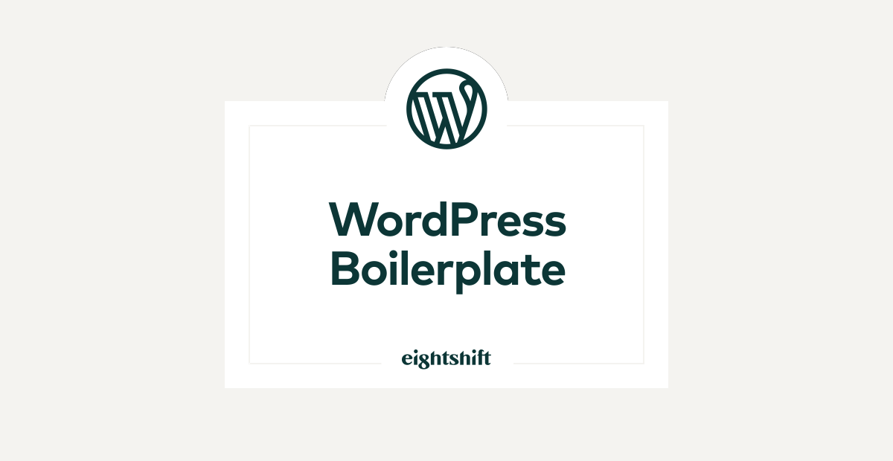

  

# Eightshift Frontend Libs

This lib is intended to work in correlation with [Eightshift Libs](https://github.com/infinum/eightshift-libs/) and [Eightshift Boilerplate](https://github.com/infinum/eightshift-boilerplate) by hosting all frontend parts for your project.
 
## It contains:
- All node modules required for the webpack build.
- Eslinter ruleset.
- Stylelinter ruleset.
- Babel ruleset.
- A collection of useful frontend utility modules.
- Gutenberg Block example.
- Gutenberg Blocks initial setup for [Eightshift Boilerplate](https://github.com/infinum/eightshift-boilerplate).
- Some cool custom components for Gutenberg.
- Complete webpack build for [Eightshift Boilerplate](https://github.com/infinum/eightshift-boilerplate).
- Helpers for dynamically create Gutenberg blocks.

For detailed documentation please check on [Eightshift Boilerplate Wiki](https://github.com/infinum/eightshift-boilerplate/wiki)

## :mailbox: Who do I talk to?

If you have any questions or problems, please [open an issue](https://github.com/infinum/eightshift-boilerplate/issues) on github and we will do our best to give you a timely answer.

Eightshift WordPress Boilerplate is maintained and sponsored by
[Eightshift](https://eightshift.com) and [Infinum](https://infinum.co).

## :scroll: License

Infinum WordPress Boilerplate is Copyright ©2018 Infinum. It is free software, and may be redistributed under the terms specified in the LICENSE file.
